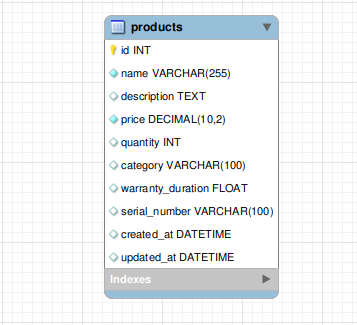
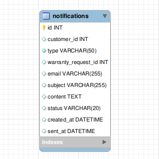
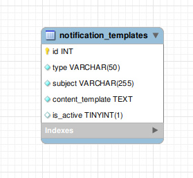
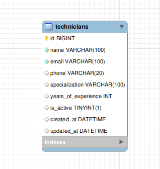

# 📊 Microservices System - Analysis and Design

Tài liệu **phân tích** và **thiết kế** cho hệ thống quản lý yêu cầu bảo hành sản phẩm dựa trên kiến trúc microservices.

---

## 1. 🎯 Problem Statement

Hệ thống giải quyết vấn đề quản lý các yêu cầu bảo hành sản phẩm từ khi tiếp nhận đến khi hoàn thành.

- **Người dùng**:

  - Khách hàng cần dịch vụ bảo hành cho sản phẩm
  - Nhân viên dịch vụ khách hàng xử lý yêu cầu bảo hành
  - Kỹ thuật viên kiểm tra và sửa chữa sản phẩm

- **Mục tiêu chính**:
  - Tối ưu hóa quy trình yêu cầu bảo hành từ khi gửi đến khi hoàn thành
  - Xác thực điều kiện bảo hành một cách tự động và nhất quán
  - Thông báo cho khách hàng ở mỗi giai đoạn của quy trình

## 2. 🧩 Identified Microservices

| Service Name                   | Type Service    | Responsibility                                                             | Tech Stack         |
| ------------------------------ | --------------- | -------------------------------------------------------------------------- | ------------------ |
| Warranty Service               | Task Service    | Xử lý việc đăng ký và xác thực điều kiện bảo hành                          | Spring Boot, MySQL |
| Customer Service               | Entity Service  | Quản lý thông tin khách hàng, bao gồm lịch sử mua hàng và yêu cầu bảo hành | Spring Boot, MySQL |
| Product Service                | Entity Service  | Quản lý sản phẩm,bao gồm số serial và thời hạn bảo hành                    | Spring Boot, MySQL |
| Technician Service             | Entity Service  | Quản lý thông tin về các kỹ thuật viên phụ trách kiểm tra                  | Spring Boot, MySQL |
| Survey Service                 | Entity Service  | Thu thập phản hồi từ khách hàng về chất lượng dịch vụ bảo hành             | Spring Boot, MySQL |
| Repair Service                 | Micro Service   | Theo dõi tiến độ sửa chữa sản phẩm, cập nhật trạng thái                    | Spring Boot, MySQL |
| Condition Verification Service | Micro Service   | Quản lý quá trình sửa chữa và bảo trì                                      | Spring Boot, MySQL |
| Notification Service           | Utility Service | Gửi thông báo cho khách hàng và nhân viên                                  | Spring Boot, MySQL |
| Security Service               | Utility Service | Xác thực và phân quyền người dùng                                          | Spring Boot, MySQL |

## 3. 🔄 Service Communication

- Gateway ⇄ security-service (REST)
- Internal:
  - service-warranty ⇄ service-notification (message queue :kafka)
  - service-warranty ⇄ service-customer (REST)
  - service-warranty ⇄ service-product (REST)
  - service-warranty ⇄ service-repair (REST)
  - service-warranty ⇄ service-technician (REST)
  - service-warranty ⇄ service-condition (REST)

---

## 4. 🗂️ Data Design

Mô tả cách dữ liệu được cấu trúc và lưu trữ trong từng service.

### SERVICE-PRODUCT

Bảng `products` lưu trữ thông tin chi tiết về sản phẩm, với các trường sau:

| Thuộc tính          | Kiểu dữ liệu  | Mô tả                              |
| ------------------- | ------------- | ---------------------------------- |
| `id`                | INT           | Mã định danh duy nhất của sản phẩm |
| `name`              | VARCHAR(255)  | Tên sản phẩm                       |
| `description`       | VARCHAR(255)  | Mô tả ngắn gọn về sản phẩm         |
| `price`             | DECIMAL(38,2) | Giá sản phẩm                       |
| `quantity`          | INT           | Số lượng hiện có                   |
| `category`          | VARCHAR(255)  | Danh mục sản phẩm                  |
| `warranty_duration` | FLOAT         | Thời gian bảo hành                 |
| `serial_number`     | VARCHAR(255)  | Số serial của sản phẩm             |
| `created_at`        | DATETIME      | Ngày tạo bản ghi                   |
| `updated_at`        | DATETIME      | Ngày cập nhật bản ghi lần cuối     |

#### Sơ đồ cấu trúc bảng `products`:

  

### SERVICE-NOTIFICATION

Bảng `notifications` lưu thông tin về các thông báo được gửi đến khách hàng. Dưới đây là mô tả chi tiết các trường dữ liệu:

| Thuộc tính            | Kiểu dữ liệu | Mô tả                               |
| --------------------- | ------------ | ----------------------------------- |
| `id`                  | INT          | Mã định danh duy nhất của thông báo |
| `customer_id`         | INT          | Mã khách hàng nhận thông báo        |
| `type`                | VARCHAR(50)  | Loại thông báo                      |
| `warranty_request_id` | INT          | Mã yêu cầu bảo hành                 |
| `email`               | VARCHAR(255) | Địa chỉ email nhận thông báo        |
| `subject`             | VARCHAR(255) | Tiêu đề của thông báo               |
| `content`             | TEXT         | Nội dung đầy đủ của thông báo       |
| `status`              | VARCHAR(20)  | Trạng thái của thông báo            |
| `created_at`          | DATETIME     | Ngày tạo bản ghi                    |
| `sent_at`             | DATETIME     | Thời điểm thông báo đã được gửi     |

#### Sơ đồ cấu trúc bảng `notifications`:

  

Bảng `notification_templates` lưu trữ các mẫu thông báo có thể được tái sử dụng để gửi cho người dùng. Đây là cách để quản lý nội dung một cách linh hoạt và đồng nhất.

| Thuộc tính         | Kiểu dữ liệu | Mô tả                                   |
| ------------------ | ------------ | --------------------------------------- |
| `id`               | INT          | Mã định danh duy nhất của mẫu thông báo |
| `type`             | VARCHAR(50)  | Loại thông báo                          |
| `subject`          | VARCHAR(255) | Tiêu đề của thông báo                   |
| `content_template` | TEXT         | Nội dung mẫu                            |
| `is_active`        | TINYINT(1)   | Trạng thái hoạt động của mẫu            |

#### Sơ đồ cấu trúc bảng `notification_templates`:

  

### SERVICE-TECHNICIAN

Bảng `technicians` lưu trữ thông tin về các kỹ thuật viên, người thực hiện bảo hành hoặc sửa chữa sản phẩm cho khách hàng.

| Thuộc tính            | Kiểu dữ liệu | Mô tả                                      |
| --------------------- | ------------ | ------------------------------------------ |
| `id`                  | BIGINT       | Mã định danh duy nhất của kỹ thuật viên    |
| `name`                | VARCHAR(100) | Tên kỹ thuật viên                          |
| `email`               | VARCHAR(100) | Địa chỉ email                              |
| `phone`               | VARCHAR(20)  | Số điện thoại                              |
| `specialization`      | VARCHAR(100) | Chuyên môn                                 |
| `years_of_experience` | INT          | Số năm kinh nghiệm làm việc trong lĩnh vực |
| `is_active`           | TINYINT(1)   | Trạng thái hoạt động                       |
| `created_at`          | DATETIME     | Ngày tạo bản ghi                           |
| `updated_at`          | DATETIME     | Ngày cập nhật bản ghi lần cuối             |

#### Sơ đồ cấu trúc bảng `technicians`:

  

---

## 5. 🔐 Security Considerations

- Use JWT for user sessions
- Validate input on each service
- Role-based access control for APIs

---

## 6. 📦 Deployment Plan

- Use `docker-compose` to manage local environment
- Each service has its own Dockerfile

---

## 7. 🎨 Architecture Diagram

---

## ✅ Summary

Summarize why this architecture is suitable for your use case, how it scales, and how it supports independent development and deployment.

## Author

| MSV          | Họ Và Tên           |
| ------------ | ------------------- |
| `B21DCCN031` | Trịnh Vinh Tuấn Đạt |
| `B21DCCN343` | Nguyễn Hoàng Hiệp   |
| `B21DCCN691` | Hà Cường Thịnh      |

k
